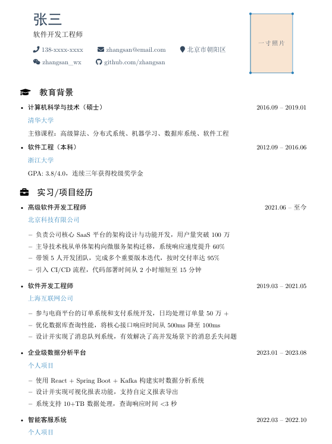

# Easy Resume - 简约中文简历模板

> 一个简洁美观的 LaTeX 中文简历模板，支持一寸照片，适合求职使用


## 预览



**[中文文档](README.md)** | **[English Documentation](README_EN.md)**

## 特点

- 简约设计，布局清晰
- 包含一寸照片占位符
- 支持中文（使用 XeLaTeX 编译）
- 响应式布局，内容紧凑
- 精美装饰元素
- 丰富的 FontAwesome 图标支持

## 简历结构

```
1. 个人信息（姓名、职位、联系方式、一寸照片）
2. 教育背景
3. 实习/项目经历
4. IT技能
5. 获奖情况
6. 其他（可选）
```

## 环境要求

- **LaTeX 发行版**: TeX Live / MiKTeX / MacTeX
- **编译引擎**: XeLaTeX（支持中文）
- **必需宏包**:
  - `ctex` - 中文支持
  - `fontawesome5` - 图标
  - `tikz` - 绘图
  - `titlesec` - 标题格式
  - `xcolor` - 颜色支持

## 快速开始

### 1. 安装依赖

**TeX Live (Linux/macOS):**
```bash
sudo tlmgr install ctex fontawesome5 tikz titlesec xcolor
```

**MiKTeX (Windows):**
- 使用 MiKTeX Console 安装上述宏包

### 2. 编译简历

**中文版本：**
```bash
xelatex resume_template.tex
```

**英文版本：**
```bash
xelatex resume_template_en.tex
```

或者多次编译以正确生成目录（如有）：
```bash
xelatex resume_template.tex
xelatex resume_template.tex
```

### 3. 查看结果

编译成功后会生成 `resume_template.pdf` 文件。

## 自定义指南

### 修改个人信息

编辑 `resume_template.tex` 文件中的以下内容：

```latex
% 修改姓名
{\Huge \bfseries \color{secondarycolor} 张三}

% 修改职位
{\large 软件开发工程师}

% 修改联系方式
{\faPhone} 138-xxxx-xxxx
{\faEnvelope} zhangsan@email.com
{\faMapMarker} 北京市朝阳区
{\faWeixin} zhangsan_wx
{\faGithub} github.com/zhangsan
```

### 添加一寸照片

1. 准备一寸照片（25mm × 35mm）命名为 `photo.jpg`
2. 将照片放在与 `.tex` 文件同级目录
3. 取消注释照片显示代码：

```latex
% 中文版本（resume_template.tex，第 89 行）：
% \node[anchor=south west,inner sep=0] at (0,0) {\includegraphics[width=2.5cm,height=3.5cm]{photo.jpg}};

% 英文版本（resume_template_en.tex，第 74 行）：
% \node[anchor=south west,inner sep=0] at (0,0) {\includegraphics[width=2.5cm,height=3.5cm]{photo.jpg}};
```

### 修改颜色主题

在文档开头修改颜色定义：

```latex
\definecolor{primarycolor}{RGB}{41, 128, 185}      % 主色（蓝色）
\definecolor{secondarycolor}{RGB}{52, 73, 94}       % 次色（深灰）
\definecolor{accentcolor}{RGB}{231, 76, 60}         % 强调色（红色）
\definecolor{decorcolor}{RGB}{230, 126, 34}         % 装饰色（橙色）
```

### 修改 Section 图标

可用的 FontAwesome 图标：

```latex
\faUser          % 个人简介
\faGraduationCap % 教育背景
\faBriefcase     % 工作经历
\faTools         % 技能
\faProjectDiagram % 项目
\faAward         % 奖项
\faInfoCircle    % 其他信息
```

## 目录结构

```
easy-resume/
├── resume_template.tex    # 中文简历模板
├── resume_template_en.tex # 英文简历模板
├── photo.jpg             # 一寸照片（需自行添加）
├── README.md             # 项目说明（中文）
├── README_EN.md          # 项目说明（英文）
├── CONTRIBUTING.md       # 贡献指南
├── CHANGELOG.md          # 版本更新日志
├── LICENSE               # MIT 许可证
├── build.sh              # 编译脚本（Linux/macOS）
├── build.bat             # 编译脚本（Windows）
├── Makefile              # Make 编译配置
└── examples/             # 示例和额外资源
    └── README.md         # 照片添加说明
```

## 常见问题

### Q: 编译报错怎么办？

A: 请确保：
1. 使用 XeLaTeX 而非 pdflatex
2. 已安装所有必需的宏包
3. 源文件保存为 UTF-8 编码

### Q: 照片比例不对？

A: 编辑照片框尺寸（第 89 行）：
```latex
% 调整 width 和 height 参数
{\includegraphics[width=2.5cm,height=3.5cm]{photo.jpg}}
```

### Q: 如何调整间距？

A: 修改以下参数：
```latex
\setlength{\parskip}{0.15em}           % 段落间距
\titlespacing{\section}{0pt}{8pt}{5pt} % section 上下间距
\setlist[itemize]{itemsep=0.05em}       % 列表项间距
```

### Q: 中文显示为乱码？

A: 确保：
1. 文件保存为 UTF-8 编码
2. 使用 XeLaTeX 编译
3. 已安装中文字体

## 贡献

欢迎提交 Issue 和 Pull Request！

1. Fork 本仓库
2. 创建特性分支 (`git checkout -b feature/AmazingFeature`)
3. 提交更改 (`git commit -m 'Add some AmazingFeature'`)
4. 推送分支 (`git push origin feature/AmazingFeature`)
5. 开启 Pull Request

## 许可证

本项目采用 MIT 许可证 - 详见 [LICENSE](LICENSE) 文件

## 致谢

- [ctex 宏包](https://ctan.org/pkg/ctex) - 中文支持
- [fontawesome5](https://ctan.org/pkg/fontawesome5) - 图标库
- [Overleaf](https://www.overleaf.com/) - 在线 LaTeX 编辑器

## 联系方式

如有问题或建议，请通过以下方式联系：
- 提交 Issue
- 发送邮件至：[your-email@example.com]

---

如果这个模板对你有帮助，请给一个 Star ⭐
