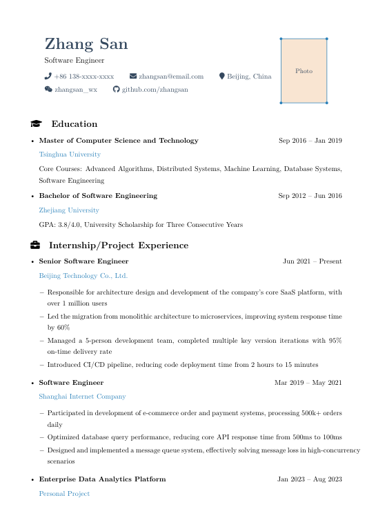

# Easy Resume - Simple Chinese Resume Template

> A clean and elegant LaTeX resume template with Chinese support and one-inch photo placeholder, perfect for job applications


## Preview



**[English Documentation](README_EN.md)** | **[中文文档](README.md)**

## Features

- Clean and minimalist design
- One-inch photo placeholder included
- Chinese language support (compile with XeLaTeX)
- Responsive layout, compact content
- Beautiful decorative elements
- Rich FontAwesome icon support

## Resume Structure

```
1. Personal Information (Name, Position, Contact, One-inch Photo)
2. Education Background
3. Internship/Project Experience
4. IT Skills
5. Awards & Certifications
6. Additional Information (Optional)
```

## Requirements

- **LaTeX Distribution**: TeX Live / MiKTeX / MacTeX
- **Compiler**: XeLaTeX (for Chinese support)
- **Required Packages**:
  - `ctex` - Chinese language support
  - `fontawesome5` - Icons
  - `tikz` - Drawing
  - `titlesec` - Title formatting
  - `xcolor` - Color support

## Quick Start

### 1. Install Dependencies

**TeX Live (Linux/macOS):**
```bash
sudo tlmgr install ctex fontawesome5 tikz titlesec xcolor
```

**MiKTeX (Windows):**
- Install the above packages using MiKTeX Console

### 2. Compile Resume

**For Chinese version:**
```bash
xelatex resume_template.tex
```

**For English version:**
```bash
xelatex resume_template_en.tex
```

Or compile twice to generate the table of contents (if applicable):
```bash
xelatex resume_template.tex
xelatex resume_template.tex
```

### 3. View Result

After successful compilation, a `resume_template.pdf` file will be generated.

## Customization Guide

### Modify Personal Information

Edit the following content in `resume_template.tex`:

```latex
% Change name
{\Huge \bfseries \color{secondarycolor} Zhang San}

% Change position
{\large Software Engineer}

% Change contact info
{\faPhone} 138-xxxx-xxxx
{\faEnvelope} zhangsan@email.com
{\faMapMarker} Beijing, China
{\faWeixin} zhangsan_wx
{\faGithub} github.com/zhangsan
```

### Add One-inch Photo

1. Prepare a one-inch photo (25mm × 35mm) named `photo.jpg`
2. Place the photo in the same directory as the `.tex` file
3. Uncomment the photo line:

```latex
% For Chinese version (resume_template.tex, line 89):
% \node[anchor=south west,inner sep=0] at (0,0) {\includegraphics[width=2.5cm,height=3.5cm]{photo.jpg}};

% For English version (resume_template_en.tex, line 74):
% \node[anchor=south west,inner sep=0] at (0,0) {\includegraphics[width=2.5cm,height=3.5cm]{photo.jpg}};
```

### Modify Color Theme

Edit the color definitions at the beginning of the document:

```latex
\definecolor{primarycolor}{RGB}{41, 128, 185}      % Primary color (blue)
\definecolor{secondarycolor}{RGB}{52, 73, 94}       % Secondary color (dark gray)
\definecolor{accentcolor}{RGB}{231, 76, 60}         % Accent color (red)
\definecolor{decorcolor}{RGB}{230, 126, 34}         % Decoration color (orange)
```

### Modify Section Icons

Available FontAwesome icons:

```latex
\faUser          % Personal profile
\faGraduationCap % Education
\faBriefcase     % Work experience
\faTools         % Skills
\faProjectDiagram % Projects
\faAward         % Awards
\faInfoCircle    % Additional info
```

## Directory Structure

```
easy-resume/
├── resume_template.tex    # Chinese resume template
├── resume_template_en.tex # English resume template
├── photo.jpg             # One-inch photo (add yourself)
├── README.md             # Project documentation (Chinese)
├── README_EN.md          # Project documentation (English)
├── CONTRIBUTING.md       # Contribution guide
├── CHANGELOG.md          # Version history
├── LICENSE               # MIT License
├── build.sh              # Build script (Linux/macOS)
├── build.bat             # Build script (Windows)
├── Makefile              # Make configuration
└── examples/             # Examples and resources
    └── README.md         # Photo usage guide
```

## Build Scripts

### Windows
Double-click `build.bat` or run:
```cmd
build.bat
```

### Linux/macOS
```bash
./build.sh
# or
make
```

## FAQ

### Q: Compilation errors?

A: Please ensure:
1. Use XeLaTeX instead of pdflatex
2. All required packages are installed
3. Source file is saved in UTF-8 encoding

### Q: Photo aspect ratio wrong?

A: Edit photo dimensions (line 89):
```latex
% Adjust width and height parameters
{\includegraphics[width=2.5cm,height=3.5cm]{photo.jpg}}
```

### Q: How to adjust spacing?

A: Modify the following parameters:
```latex
\setlength{\parskip}{0.15em}           % Paragraph spacing
\titlespacing{\section}{0pt}{8pt}{5pt} % Section top/bottom spacing
\setlist[itemize]{itemsep=0.05em}       % List item spacing
```

### Q: Chinese characters appear garbled?

A: Ensure:
1. File is saved in UTF-8 encoding
2. Compiled with XeLaTeX
3. Chinese fonts are installed

## Contributing

Issues and Pull Requests are welcome!

1. Fork this repository
2. Create a feature branch (`git checkout -b feature/AmazingFeature`)
3. Commit your changes (`git commit -m 'Add some AmazingFeature'`)
4. Push to the branch (`git push origin feature/AmazingFeature`)
5. Open a Pull Request

## License

This project is licensed under the MIT License - see the [LICENSE](LICENSE) file for details

## Acknowledgments

- [ctex package](https://ctan.org/pkg/ctex) - Chinese language support
- [fontawesome5](https://ctan.org/pkg/fontawesome5) - Icon library
- [Overleaf](https://www.overleaf.com/) - Online LaTeX editor

## Contact

For questions or suggestions, please contact:
- Submit an Issue
- Email: [your-email@example.com]

---

If this template is helpful, please give it a Star ⭐
